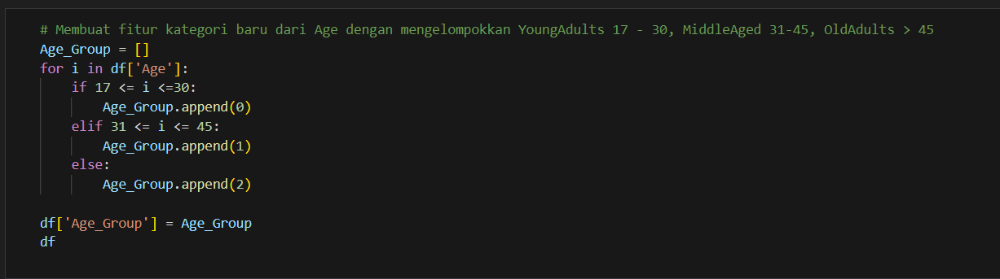
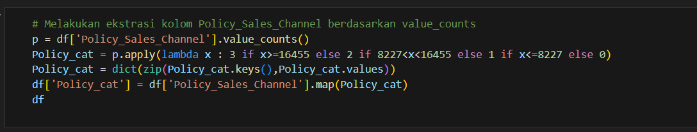

# **Health Insurance : Cross-Sell Prediction**


### **About Dataset**

> Context: 

#### Our client is an Insurance company that has provided Health Insurance to its customers now they need your help in building a model to predict whether the policyholders (customers) from past year will also be interested in Vehicle Insurance provided by the company.

#### An insurance policy is an arrangement by which a company undertakes to provide a guarantee of compensation for specified loss, damage, illness, or death in return for the payment of a specified premium. A premium is a sum of money that the customer needs to pay regularly to an insurance company for this guarantee.

#### Just like medical insurance, there is vehicle insurance where every year customer needs to pay a premium of certain amount to insurance provider company so that in case of unfortunate accident by the vehicle, the insurance provider company will provide a compensation (called ‘sum assured’) to the customer.

#### Building a model to predict whether a customer would be interested in Vehicle Insurance is extremely helpful for the company because it can then accordingly plan its communication strategy to reach out to those customers and optimise its business model and revenue.


**Dataset** [Here](https://www.kaggle.com/datasets/anmolkumar/health-insurance-cross-sell-prediction/data)


## **Goals**

`Increasing revenue from cross-selling additional Vehicle Insurance products.`

## **Objective**

- Building a Machine Learning model to predict potential buyers who are interested in vehicle insurance.

- Increasing Conversion Rate.

## **Business Metrics**

**`Conversion Rate`**


The number of customers who decide to take additional products such as Vehicle Insurance, indirectly increasing the company's revenue.

## **Modelling Flow**

- Exploratory Data Analysis

- Data Pre-Processing

- Modelling

- Deployment
<br>
<br>
<br>


# **Getting Started**

## **Import Library**

```sh
import warnings
warnings.filterwarnings('ignore')

import numpy as np
import pandas as pd
import seaborn as sns
from scipy import stats
import matplotlib.pyplot as plt
from matplotlib import rcParams
%matplotlib inline
from sklearn.preprocessing import MinMaxScaler, StandardScaler, RobustScaler
from scipy.stats import boxcox
from imblearn import under_sampling, over_sampling
import gdown
from sklearn.model_selection import train_test_split

from mlxtend.plotting import plot_confusion_matrix
from sklearn.metrics import accuracy_score, precision_score, recall_score, f1_score, roc_auc_score, roc_curve, confusion_matrix, fbeta_score, make_scorer
from sklearn.experimental import enable_halving_search_cv
from sklearn.model_selection import cross_validate, RandomizedSearchCV, GridSearchCV, HalvingGridSearchCV
from sklearn.ensemble import RandomForestClassifier, GradientBoostingClassifier
from sklearn.linear_model import LogisticRegression, Ridge, Lasso, ElasticNet
from sklearn.svm import SVR
from sklearn.neighbors import KNeighborsClassifier
from sklearn.tree import DecisionTreeClassifier
from xgboost import XGBClassifier
from lightgbm import LGBMClassifier, reset_parameter, LGBMClassifier

import shap

from scipy.stats import randint as sp_randint
from scipy.stats import uniform as sp_uniform

print('numpy version : ',np.__version__)
print('pandas version : ',pd.__version__)
print('seaborn version : ',sns.__version__)
```
<br>
<br>
<br>
<br>

## **Load Dataset**


<br>
<br>

## **Exploratory Data Analysis (EDA)**


### Performing Descriptive Statistics on the dataset to check for missing data.
### The result obtained shows that there is no missing data in the dataset.
<br>
<br>
<br>
<br>
<br>


### From the above boxplot, it can be seen that there are `no outliers except for the Annual Premium column`.
### This is because there are some customers who pay their premiums above the average.
<br>
<br>
<br>
<br>
<br>


### Here, there is no feature that has a high correlation with the target, which is response... but there are features that have a strong negative correlation between them, namely age and policy sales channel with a correlation coefficient of -0.58.

### `There is no multicollinearity`, so no data needs to be dropped.
<br>
<br>
<br>
<br>
<br>


## **Business Insight**


### Vehicle insurance is more attractive to customers aged `30-50 years` and mostly attracted by `male` customers compared to `female` customers
<br>
<br>
<br>
<br>
<br>


### Then customers whose vehicle conditions are `not good` and customers whose vehicle age is still quite young (`1-2 years`) have an interest in buying vehicle insurance.
<br>
<br>
<br>
<br>
<br>


### Here it can be seen that customers with a vintage of `5-8 months` have more `interest` than others.

### and customers who `do not have vehicle insurance` are more `interested` in about 20% of the total customers who do not have vehicle insurance.
<br>
<br>
<br>
<br>
<br>

## **Data Pre-Processing**

>### Handling Missing Value


### Out of 12 columns, there are no `missing values`.
<br>
<br>
<br>
<br>
<br>

>### Handling Duplicates Value


### After checking for duplicated values, there is `no duplicate data` in the dataset.
<br>
<br>
<br>
<br>
<br>

>### Handling Outliers


### From the graph that we get when EDA has been done in Stage 1, we know `Annual Premium` has outliers that are extreme enough to be handled by IQR removal or capping.
<br>
<br>
<br>


### It was decided to keep using the df dataframe because, it is normal for the `Annual_Premium` column to have outliers so no outliers were removed. This is also based on the consideration of building a model that is robust to outliers.
<br>
<br>
<br>
<br>
<br>

>### Feature Encoding


#### Converts `Vehicle_Damage` to an integer in = 0: Customer's vehicle has never been damaged, 1: Customer's vehicle has been damaged, and `Vehicle_Age` and 0: < 1 Year, 1: 1-2 Years, 2: > 2 Years. And `Gender` with *One Hot Encoding*. Convert to numbers starting from 0 to facilitate machine learning. Convert columns with datatype bool to int to make it easier for the model to process.
<br>
<br>
<br>
<br>
<br>

>### Class Imbalance


#### Class Imbalance handling is done with ***oversampling*** and ***undersampling*** with the consideration that the data does not tend to be biased, where the difference between the two values 0 and 1 is more than 50% so that if *oversampling* is done, it does not guarantee an increase in machine learning performance, but oversampling is also needed so that the data does not underfit.
<br>
<br>
<br>
<br>
<br>

>### Feature Extraction






### 4 New Features

1. `Premium_Per_Channel`, to calculate and provide new insight into the total premium of various `Policy_Sales_Channels` so that channel grouping can be done based on `Annual_Premium`.

2. `Vintage_Group`, a new feature that converts the `Vintage` feature into a category with a certain range which is defined as New (just joined), Intermediate (joined for a while), Long-term (joined for a long time).

3. `Not_Insured_and_Damaged`, a column that takes the value 1 if the `Previously_Insured` column has the value 0 and `Vehicle_Damage` has the value 1.

4. `Channel_Response_Rate`, is the response rate of each channel which indicates how effective a channel is to get a 'Yes' answer from here can also be done grouping Channels that have a high rate.
<br>
<br>
<br>
<br>
<br>

## **Modelling**

### Hasil Score Modeling

|Model|Accuracy Test|Accuracy Train|Precision Test|Precision Train|Recall Test|Recall Train|F1 Test|F1 Train|ROC AUC Test|ROC AUC Train|ROC AUC CrossVal Test|ROC AUC CrossVal Train|
|:-:|:-:|:-:|:-:|:-:|:-:|:-:|:-:|:-:|:-:|:-:|:-:|:-:|
|Logistic|0.79|0.79|0.72|0.72|0.93|0.94|0.82|0.82|0.87|0.87|0.93|0.92|
|KNN|0.79|0.80|0.78|0.78|0.83|0.83|0.80|0.80|0.89|0.89|0.93|0.92|
|Decision Tree|0.82|0.83|0.78|0.79|0.89|0.90|0.83|0.84|0.91|0.93|0.93|0.92|
|XGBoost|0.82|0.83|0.78|0.78|0.91|0.91|0.84|0.84|0.92|0.92|0.93|0.92|
|Random Forest|0.82|0.83|0.78|0.79|0.89|0.90|0.83|0.84|0.92|0.93|0.93|0.92|
|LightGBM|0.82|0.82|0.77|0.77|0.91|0.91|0.84|0.84|0.92|0.92|0.93|0.92|
|Gradient Boost|0.82|0.82|0.76|0.76|0.93|0.92|0.84|0.84|0.91|0.91|0.93|0.92|
<br>
<br>
<br>

### Hasil Score Setelah Hyperparameter Tuning

|Model|Accuracy Test|Accuracy Train|Precision Test|Precision Train|Recall Test|Recall Train|F1 Test|F1 Train|ROC AUC Test|ROC AUC Train|ROC AUC CrossVal Test|ROC AUC CrossVal Train|
|:-:|:-:|:-:|:-:|:-:|:-:|:-:|:-:|:-:|:-:|:-:|:-:|:-:|
|Logistic|0.78|0.79|0.71|0.71|0.96|0.95|0.82|0.82|0.87|0.87|0.93|0.92|
|Decision Tree|0.79|0.79|0.73|0.72|0.94|0.94|0.82|0.82|0.86|0.86|0.93|0.92|
|XGBoost|0.82|0.82|0.76|0.76|0.94|0.94|0.84|0.84|0.92|0.92|0.93|0.92|
|Random Forest|0.81|0.81|0.74|0.74|0.95|0.95|0.83|0.83|0.89|0.89|0.93|0.92|
|LightGBM|0.82|0.82|0.77|0.77|0.92|0.92|0.84|0.84|0.92|0.92|0.93|0.92|
|Gradient Boost|0.82|0.82|0.76|0.76|0.93|0.93|0.84|0.83|0.91|0.91|0.93|0.92|


#### From the characteristics of the dataset that does not have *class imbalance* and business objectives, the evaluation will focus on the ***recall*** score which minimizes False Negative and ***ROC AUC*** score to assess the extent to which the model is able to distinguish classes (TPR and FPR) even though the *class* is balanced.

#### From the score above, it is found that the model that has a good score for classification prediction is the model resulting from the `XGBoost`, `LightGBM`, `Random Forest` and `Gradient Boost` algorithms.
<br>
<br>
<br>
<br>
<br>

## **The Best Fit Model**

### `XGBoost Model`

#### This model has a high recall score that reaches **0.94** with a machine learning probability of **0.92** and AUC ROC reaching **0.91** on the test data results. While the train data only has the largest difference of 0.02 from the test data, which is the model neither overfit nor underfit which can be referred to as the ***best fit*** model.


#### * `'Previously_Insured'`: High values have a negative contribution to the prediction result while low values have a positive contribution to the prediction result.
#### * `'Policy_Sales_Channel'`: The higher value has a negative contribution to the prediction while the lower value has a positive contribution to the prediction result.
#### * `Vehicle_Damage`: The higher the value has a positive contribution to the prediction and the lower the value has a negative contribution to the prediction.
#### * `Region_cat`: The mid-to-high value has a negative contribution to the prediction and the low value has a positive contribution.
#### * `Gen_Female`: High values contribute negatively and low values contribute positively.
#### * `Gen_Male`: High values contribute negatively and low values contribute positively.
#### * `Age_Group`: Low and high values have a negative contribution to prediction while values in the middle have a positive contribution.
#### * `Vehicle_Age`: The higher the value the more negative the contribution, and the lower the value the more positive the contribution to the prediction.
<br>
<br>
<br>
<br>
<br>

## **Business Recomendation**

#### * Focus on the Middle Ages 31 - 45 market segment, to offer products that suit their needs and preferences. For example, insurance products that provide broader protection, payment flexibility, and ease of claims.
#### * Conduct product offering campaigns and education to increase awareness of vehicle insurance for the long term.
#### * Conduct more intensive and personalized marketing strategies to the vintage segment (Customers with a vintage of 5-8 months), such as sending promotional emails, providing special discounts, or offering more complete insurance packages. Thus, the Company can increase customer loyalty, expand market share, and increase the Company's revenue.
